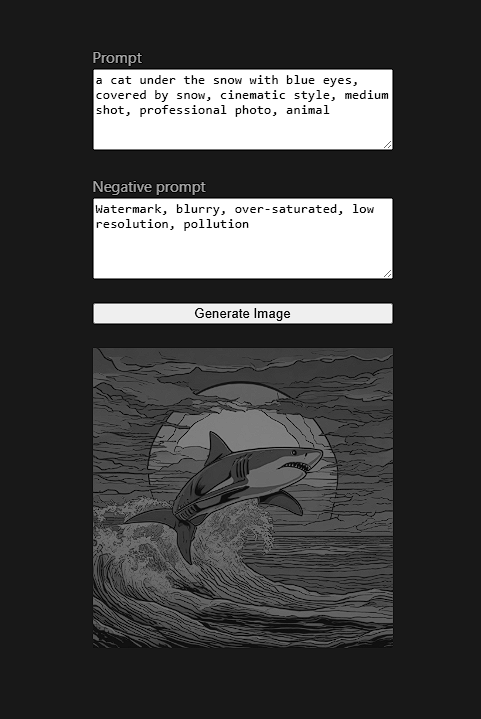
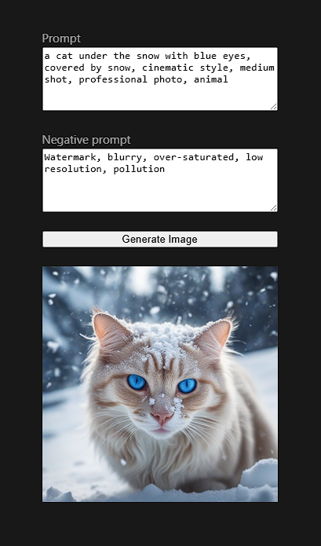

# RDNA3 + RDNA4 Demo

In this technology preview demo, we will set up Stable Diffusion XL (SDXL) running locally on
RDNA4 (AMD Radeon RX 9070 XT and 9070) and RDNA3 (AMD Radeon 7900 XTX and Radeon Pro W7900).
SDXL is a popular text to image ML model.

Our demo benefits from improved AI accelerator hardware introduced in RDNA4 that improves
performance on data types already supported by RDNA3 like fp16, and enabled support for a new data
type: fp8 (OCP).

## Installation

### Prerequisites

* Ubuntu 24.04 or 22.04 (not tested on other systems)
* Python 3.11 or 3.12
* RDNA4 (gfx1201) or RDNA3 (gfx1100) AMD GPU

Create a new directory for the demo:

```shell
mkdir demo
cd demo
```

### Install ROCm Community Edition

Simply download the matching tarball, extract it, and add it to your environment variables:

```shell
mkdir rocm
cd rocm
# Check GitHub releases for other distributions.
wget https://therock-artifacts.s3.us-east-2.amazonaws.com/therock-dist-gfx1201-20250305.tar.gz
tar -xzf therock-dist-gfx1201-20250305.tar.gz
export PATH="$PWD/bin:$PATH"
export LD_LIBRARY_PATH="$PWD/lib:$LD_LIBRARY_PATH"
cd ..
```

You can find other ROCm Community releases in the [TheRock repository](https://github.com/ROCm/TheRock).

Confirm that your GPU is detected:
```console
~/demo
➜  which rocm-smi
/home/jakub/demo/rocm/bin/rocm-smi
~/demo
➜  rocm-smi
======================================== ROCm System Management Interface ========================================
================================================== Concise Info ==================================================
Device  Node  IDs              Temp    Power  Partitions          SCLK  MCLK   Fan    Perf  PwrCap  VRAM%  GPU%
              (DID,     GUID)  (Edge)  (Avg)  (Mem, Compute, ID)
==================================================================================================================
0       2     0x7550,   37870  32.0°C  3.0W   N/A, N/A, 0         0Mhz  96Mhz  0%     auto  0.0W    5%     0%
1       1     0x7448,   7019   31.0°C  7.0W   N/A, N/A, 0         0Mhz  96Mhz  20.0%  auto  241.0W  0%     0%
==================================================================================================================
============================================== End of ROCm SMI Log ===============================================
```

Above, `rocm-smi` lists two GPUs: a Radeon RX 9070 and a Radeon Pro W7900.

### Install SHARK AI and Shortfin

1. Create and activate a Python Virtual Environment:

    ```shell
    python -m venv ./.venv
    source .venv/bin/activate
    ```

1. Clone the shark-ai repository:

    ```shell
    git clone https://github.com/nod-ai/shark-ai && cd shark-ai
    ```

1. Install dependencies:

    ```shell
    pip install -r requirements-iree-pinned.txt
    pip install -r pytorch-cpu-requirements.txt
    pip install -r requirements.txt
    ```

1. Install Shortfin

    ```shell
    cd shortfin && pip install --editable .
    ```

### Install SHARK UI

1. In a new terminal session, clone the shark-ui project

    ```shell
    cd demo
    git clone https://github.com/nod-ai/shark-ui.git
    cd shark-ui
    ```

1. Checkout the preview branch

    ```shell
    git checkout feature-connects-text-to-image-api
    ```

1. Install dependencies
    1. [Install node/npm](https://nodejs.org/en/download)
        1. Select highest LTS version (i.e. v22)
        1. For "using", select `nvm` if available, otherwise select `fnm`
        1. For "with", select `npm`
    1. Update `npm`:

        ```shell
        npm install -g npm@latest
        ```

    1. Use `npm` to install dependencies

        ```shell
        npm install
        ```

1. Set environment variable

    ```shell
    echo "VITE_TEXT_TO_IMAGE_API_ORIGIN=http://localhost:8000" > .env
    ```

## Usage

### Start the Shortfin SD Server

1. Go back to the terminal session with Shortfin
1. Run the command for your target (`gfx1100` for RDNA3, `gfx1201` for RDNA4):
    * On RDNA4:
      * for FP8, run:

        ```shell
        python -m python.shortfin_apps.sd.server --device=amdgpu --target=gfx1201 --build_preference=precompiled \
          --device_ids 0 --model_config=sdxl_config_fp8_ocp.json
        ```

      * for Int8, run:

        ```shell
        python -m python.shortfin_apps.sd.server --device=amdgpu --target=gfx1201 --build_preference=precompiled \
          --device_ids 0 --model_config=sdxl_config_i8.json
        ```

    * On RDNA3:
      * for FP8: not supported
      * for Int8, run:

        ```shell
        python -m python.shortfin_apps.sd.server --device=amdgpu --target=gfx1100 --build_preference=precompiled \
          --device_ids 0 --model_config=sdxl_config_i8.json
        ```

1. (Optional) Specify a network port by including the `--port <PORT-NUM>` flag.
1. Wait until you see that the server is running:

    ```console
    [2025-03-05 21:05:00] Application startup complete.
    [2025-03-05 21:05:00] Uvicorn running on http://0.0.0.0:8000 (Press CTRL+C to quit)
    ```

NOTE: The first run will download all the necessary artifacts (the model code and the weights).
This may take a while. The subsequent runs will use the artifacts cached in `~/.cache/shark/genfiles/sdxl`.

### Start the SHARK UI Text-To-Image Client

1. Go back to the terminal session that has SHARK UI
1. Serve the client:

    ```shell
    npm run dev
    ```

### Use the Client

1. Visit <http://localhost:5173> in your browser:

    

1. Modify the prompts if desired
1. Select "Generate Image":

    

1. Go back to the shortfin terminal session to see the total inference time to generate the image:

    ```console
    [2025-03-05 21:14:08] 127.0.0.1:40956 - "GET /health HTTP/1.1" 200
    [2025-03-05 21:14:23.752] [info] [metrics.py:51] Completed inference process in 4209ms
    [2025-03-05 21:14:23] 127.0.0.1:57240 - "POST /generate HTTP/1.1" 200
    ```

1. Exit the server and the client by pressing `Ctrl + C` in each terminal session.

## Preliminary performance results

> [!NOTE]
> Disclaimer: The results below are for information purpose only. The evaluation was performed
> on engineering sample hardware and may differ from retail parts.

### End-to-end image generation (fp8 and int8)

GPU Name | int8 time [s] | fp8 time [s]
-- | -- | --
RX 9070 XT | 3.9 | 3.4
RX 9070 | 4.2 | 3.7
RX 7900 XTX | 6.3 | N/A
Pro W7900 | 6.9 | N/A

Fp8 brings noticeable performance benefits compared to int8 in the SDXL model.
With int8 data types, supported both on RDNA3 and RDNA4, the RX 9070 XT card about 38%
faster than RX 7900 XTX while RX 9070 is 39% faster than Pro W7900!

### UNet isolated benchmarks (fp8 and fp16)

In addition to the total image generation time from the section above, we benchamrked a
portion of the SDXL model called 'UNet', comparing the fp16 and fp8 implementation across
RDNA3 and RDNA4. 'UNet' is typically executed 20 times when generating an image with SDXL.

GPU Name | fp16 time [ms] | fp8 time [ms]
-- | -- | --
RX 9070 XT | 217 | 140
RX 9070 | 263 | 151
RX 7900 XTX | 292 | N/A
Pro W7900 | 318 | N/A

On RDNA4, UNet compiled with fp8 data types is about 35-42% faster than fp16. Despite having fewer
Compute Units than 7900-series RDNA3 cards, 9070 and 9070 XT are noticeably faster with fp16, and
almost twice as fast with fp8.

<sup>
This comparison was performed using the
[sdxl-scripts repository](https://github.com/nod-ai/sdxl-scripts/tree/shared/rdna4)
</sup>
