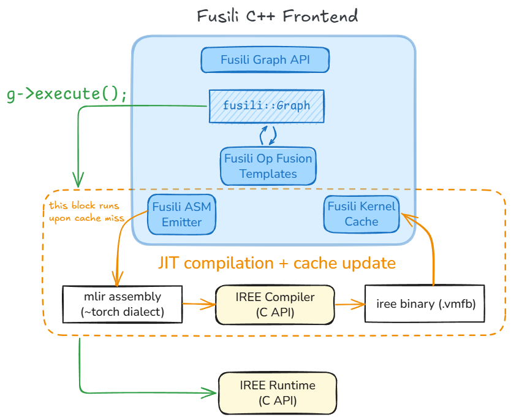

# Fusili

Fusili is a C++ Graph API and Frontend to the IREE stack (compiler & runtime), enabling JIT compilation & execution of training and inference graphs. It allows us to expose cuDNN-like primitives backed by IREE code-generated kernels.

:construction: **This project is under active development and APIs may change** :construction:

A side note on naming: 'SharkFuser' is the name of the project (may change as the project evolves), but the library itself is called 'Fusili'. Both are inspired from the term 'Fusions' - a bread-and-butter compiler optimization to improve performance.



## Developer Guide:

### Build and test (debug build):
```shell
cmake -GNinja -S. -Bbuild \
    -DCMAKE_C_COMPILER=clang \
    -DCMAKE_CXX_COMPILER=clang++ \
    -DCMAKE_LINKER_TYPE=LLD \
    -DSHARKFUSER_DEBUG_BUILD=ON
cmake --build build --target all
ctest --test-dir build
```

To re-run failed tests verbosely:
```shell
ctest --test-dir build --rerun-failed --output-on-failure --verbose
```

Tests and samples are also built as standalone binary targets in the `build/bin` directory to help with debugging isolated failures.

### Code coverage (using gcov + lcov):

This works with gcc builds (code coverage with clang instrumentation is future work).

To generate code coverage metrics:
```shell
cmake -GNinja -S. -Bbuild \
    -DCMAKE_C_COMPILER=gcc \
    -DCMAKE_CXX_COMPILER=g++ \
    -DSHARKFUSER_CODE_COVERAGE=ON
cmake --build build --target all
ctest --test-dir build -T test -T coverage
```

This generates the `*.gcda` and `*.gcno` files with coverage info. At this point one may use an IDE to visualize the coverage info inlayed with the source code. If using VSCode's gcov-viewer extension: Hit `Cmd+Shift+P` -> Gcov Viewer: Reload (Import gcda files) to load coverage info and `Cmd+Shift+P` -> Gcov Viewer: Reset (Delete gcda files) to reset it.

To generate an HTML (interactive) coverage report:
```shell
lcov --capture --directory build --output-file build/coverage.info
lcov --remove build/coverage.info 'build/*' '/usr/*' --output-file build/coverage.info
genhtml build/coverage.info --output-directory coverage_report
```

### Lint

Run clang-format:
```shell
find . -path ./build -prune -o \( -type f \( -name "*.cpp" -o -name "*.h" \) -print \) | xargs clang-format -i
```

Alternatively, run pre-commit which also runs clang-format alongwith a few other lint checks:
```shell
pre-commit run --all-files
```

### Debugging:

Fusili records execution flow through the logging interface. This is disabled by default but can be enabled for debugging.

To configure logging behavior using environment variables:

|   Set output stream \ Enable logging           | `FUSILI_LOG_INFO` = 0 | `FUSILI_LOG_INFO` = 1
| ---------------------------------------------- | ----------------------| ----------------------
| `FUSILI_LOG_FILE` not set                      | no logging            | no logging
| `FUSILI_LOG_FILE` set to `stdout` or `stderr`  | no logging            | logging to cout / cerr
| `FUSILI_LOG_FILE` set to `/path/to/file.txt`   | no logging            | logging to file.txt

Tests and samples that are built with the cmake flag `-DSHARKFUSER_DEBUG_BUILD=ON` have their env variables automatically configured for logging to cout.

Alternatively, one may call the logging API directly as needed:
- Calling `fusili::isLoggingEnabled() = <true|false>` has the same effect as setting `FUSILI_LOG_INFO = 1|0`.
- Calling `fusili::getStream() = <stream_name>` has the same effect as setting the output stream using `FUSILI_LOG_FILE`.


## Project Roadmap
- [x] Build/test infra, logging, code coverage reporting
- [x] Graph, tensor, node datastructures / builder API
- [x] CI (GHA workflows)
- [ ] conv_fprop MLIR ASM emitter
- [ ] IREE compiler integration
- [ ] IREE runtime integration
- [ ] `g->execute()` (calls IREE compiler/runtime C API)
- [ ] conv_fprop integration testing
- [ ] Kernel cache
- [ ] Shape inference for static dims
- [ ] Non-contiguous (strided) tensor support
- [ ] Elementwise ops (relu?)
- [ ] Op fusion templates
- [ ] Python bindings
- [ ] Serialization
- [ ] hipDNN integration
