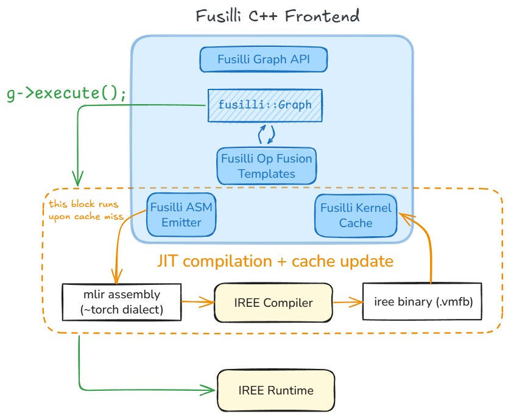

# Fusilli

Fusilli is a C++ Graph API and Frontend to the IREE stack (compiler & runtime), enabling JIT compilation & execution of training and inference graphs. It allows us to expose cuDNN-like primitives backed by IREE code-generated kernels.

:construction: **This project is under active development and APIs may change** :construction:

A side note on naming: 'SharkFuser' is the name of the project (may change as the project evolves), but the library itself is called 'Fusilli'. Both are inspired from the term 'Fusions' - a bread-and-butter compiler optimization to improve performance.



## Developer Guide

### Setup

Although optional, we recommend using docker as the canonical development setup for a no-fuss quick start, hermetic and reproducible builds, and consistency with CI. Follow [these steps](https://github.com/sjain-stanford/docker.git) to launch an interactive docker container with the required dependencies pre-installed (and skip to the `Build and Test` section below).

If you prefer a custom setup instead, the following dependencies need to be brought in to build/test Fusilli:

**Build Requirements:** cmake, ninja-build, clang, lld, IREE

**Test Requirements:** catch2, lit, FileCheck, iree-opt, iree-compile, iree-run-module

Fusilli expects a pre-built IREE distribution to be installed (preferably in `/usr/local/`). It uses this to access binaries (like `FileCheck`, `iree-opt`, `iree-compile`, `iree-run-module`) as well as for direct integration of IREE compiler and runtime libraries through the C-API interface.

Easiest way to get [`lit`](https://llvm.org/docs/CommandGuide/lit.html) is through Python (`pip install lit`). Everything else should be available via `apt` based install.

### Build and Test (debug build)

Build and test Fusilli as follows:
```shell
cmake -GNinja -S. -Bbuild \
    -DCMAKE_C_COMPILER=clang \
    -DCMAKE_CXX_COMPILER=clang++ \
    -DCMAKE_LINKER_TYPE=LLD \
    -DSHARKFUSER_DEBUG_BUILD=ON
cmake --build build --target all
ctest --test-dir build
```

To re-run failed tests verbosely:
```shell
ctest --test-dir build --rerun-failed --output-on-failure --verbose
```

Tests and samples are also built as standalone binary targets (in the `build/bin` directory) to make debugging isolated failures easier.

### Code Coverage (using gcov + lcov)

This works with gcc builds (code coverage with clang instrumentation is future work).

To generate code coverage metrics:
```shell
cmake -GNinja -S. -Bbuild \
    -DCMAKE_C_COMPILER=gcc \
    -DCMAKE_CXX_COMPILER=g++ \
    -DSHARKFUSER_CODE_COVERAGE=ON
cmake --build build --target all
ctest --test-dir build -T test -T coverage
```

This generates the `*.gcda` and `*.gcno` files with coverage info. At this point one may use an IDE to visualize the coverage info inlayed with the source code. If using VSCode's gcov-viewer extension: Hit `Cmd+Shift+P` -> Gcov Viewer: Reload (Import gcda files) to load coverage info and `Cmd+Shift+P` -> Gcov Viewer: Reset (Delete gcda files) to reset it.

To generate an HTML (interactive) coverage report:
```shell
lcov --capture --directory build --output-file build/coverage.info
# Exclude external sources from being reported in code coverage
# For example:
#   /usr/include/c++/13/*
#   /usr/include/x86_64-linux-gnu/c++/*
#   /usr/local/include/catch2/*
lcov --remove build/coverage.info '/usr/*' --output-file build/coverage.info
genhtml build/coverage.info --output-directory coverage_report
```

### Lint

Run clang-format:
```shell
find . -path ./build -prune -o \( -type f \( -name "*.cpp" -o -name "*.h" \) -print \) | xargs clang-format -i
```

Alternatively, run pre-commit which runs clang-format along with a few other lint checks:
```shell
pre-commit run --all-files
```

### Debugging

Fusilli records execution flow through the logging interface. This is disabled by default but can be enabled for debugging.

To configure logging behavior using environment variables:

|   Set output stream \ Enable logging            | `FUSILLI_LOG_INFO` = 0 | `FUSILLI_LOG_INFO` = 1
| ----------------------------------------------- | ---------------------- | ----------------------
| `FUSILLI_LOG_FILE` not set                      | no logging             | no logging
| `FUSILLI_LOG_FILE` set to `stdout` or `stderr`  | no logging             | logging to cout / cerr
| `FUSILLI_LOG_FILE` set to `/path/to/file.txt`   | no logging             | logging to file.txt

Tests and samples that are built with the cmake flag `-DSHARKFUSER_DEBUG_BUILD=ON` have their env variables automatically configured for logging to cout.

Alternatively, one may call the logging API directly as needed:
- Calling `fusilli::isLoggingEnabled() = <true|false>` has the same effect as setting `FUSILLI_LOG_INFO = 1|0`.
- Calling `fusilli::getStream() = <stream_name>` has the same effect as setting the output stream using `FUSILLI_LOG_FILE`.
